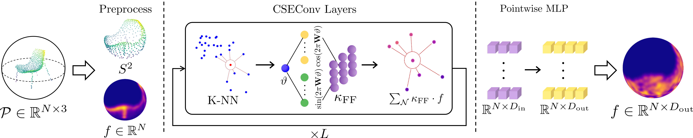

# Continuous SO(3) Equivariant Convolution for 3D Point Cloud Analysis [ECCV 2024]


## About
This repository contains the implementation of Continuous SO(3) Equivariant Convolution (CSEConv) and reproducible experiments from the corresponding paper.

## Installation & Dependencies
```bash
# Highly recommend to install PyTorch and PyTorch3D libraries
# in the conda environment with the latest version
conda create -n cse python=3.9
conda activate cse

# configure PyTorch installment with your own CUDA version
conda install pytorch torchvision torchaudio pytorch-cuda -c pytorch -c nvidia

# PyTorch3D installment
conda install -c iopath iopath
conda install pytorch3d -c pytorch3d

# Install dependencies to use training & evaluation codes
pip install tqdm omegaconf wandb matplotlib scikit-learn
```

## Dataset Configuration
* Download ModelNet40 dataset.
    * https://github.com/antao97/PointCloudDatasets
    * Download `modelnet40_hdf5_2048.zip` from the referenced link.
* Download ScanObjectNN dataset.
    * https://hkust-vgd.github.io/scanobjectnn/
    * Follow the instruction and download `h5_files.zip`.
* Create directory `dataset` and place zipped files.
* After unzip datasets, the dataset directory should look like follows:
    ```
    CSEConv
    ├── dataset
    |   ├── modelnet40_hdf5_2048.zip
    |   ├── h5_files.zip
    |   ├── modelnet40_hdf5_2048
    |   |   ├── train*.h5
    |   |   ├── test*.h5
    |   |   ├── train*id2file.json
    |   |   ├── test*id2file.json
    |   |   ├── train*id2name.json
    |   |   ├── test*id2name.json
    |   |   └── ...
    |   └── h5_files
    |       ├── main_split_nobg
    |       |   ├── training_objectdataset.h5
    |       |   ├── test_objectdataset.h5
    |       |   └── ...
    |       └── ...
    └── ...
    ```

## How to use
### Training
```bash
# ModelNet40 Classification
# --use_rotate option designates to use the rotation augmentation
python train_modelnet_cls.py --cfg fne_gelu --wandb_id $WANDB_ENTITY --use_scheduler
python train_modelnet_cls.py --cfg fne_gelu --wandb_id $WANDB_ENTITY --use_scheduler --use_rotate

# ModelNet40 Metric Learning
python train_modelnet_metric.py --cfg fne_gelu --wandb_id $WANDB_ENTITY --use_scheduler

# ScanObjectNN Classification
# --use_rotate option designates to use the rotation augmentation
python train_scannet_cls.py --cfg fne_freq_gelu --wandb_id $WANDB_ENTITY
python train_scannet_cls.py --cfg fne_freq_gelu --wandb_id $WANDB_ENTITY --use_rotate
```
### Evaluation & Visualization
```bash
# ModelNet40 Classification
# --use_rotate option designates to evaluate the model trained with rotation augmentation
python test_modelnet_cls.py
python test_modelnet_cls.py --use_rotate

# ModelNet40 Metric Learning & Visualization
python test_modelnet_metric.py
python modelnet_metric_tsne.py

# ScanObjectNN Classification
# --use_rotate option designates to evaluate the model trained with rotation augmentation
python test_scannet_cls.py
python test_scannet_cls.py --use_rotate
```

## Reproducible Weights
After the training is finished, the scripts create the `weight` directory and save weight files with the best evaluation performance.
You can skip this by downloading the [weight files (Google Drive)](https://drive.google.com/drive/folders/1-35KjyyS6Q13G22449A29SapfRbqkB4p?usp=drive_link) which reproduce the reported performance.
```
CSEConv
└── weight
    ├── modelnet
    |   ├── modelnet_cls_best.pth
    |   ├── modelnet_cls_rotated_best.pth
    |   └── modelnet_metric_best.pth
    └── scannet
        ├── scannet_cls_best.pth
        └── scannet_cls_rotated_best.pth
```
## Citation
We will update this section and the link to our paper after it is officially published.
```
```
